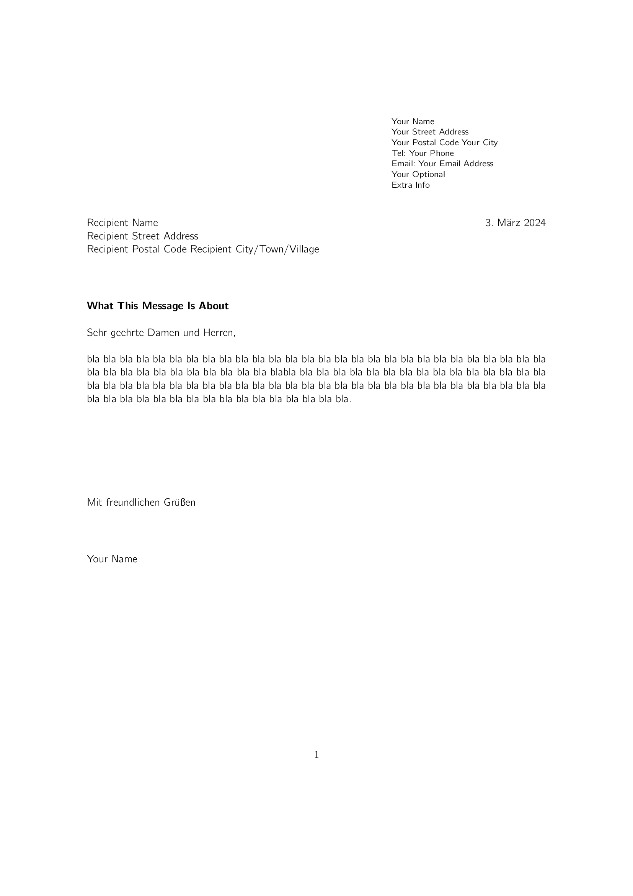

## Concise and Latex-based Din A4 letter template

Sometimes I have to write a letter. I do not want to fiddle around and google for letter templates for WYSIWYG word processors though, and I do prefer to tex.
Therefore, this repo exists. I am even using some "MS WORD-y" font.

### Building your letter as pdf:

Simply call the provided `build.sh`, which compiles the `tex` source files to `pdf` and cleans up any temporary files (note that failures are also silent):

```
#!/bin/bash
start=`date +%s`

main=letter
pdflatex $main &&
bash clean.sh

# generates png previews of the letter (mainly for the github README)
echo "generating png preview from letter.pdf"
convert -density 200 -append $main.pdf -quality 85 -alpha remove -alpha off preview/letter.png #  &> /dev/null

end=`date +%s`
runtime=$((end-start))
echo "build.sh executed in $runtime s"
du -sh $main.pdf

```

Have a look at a (short cv) preview image below.

---

### Short Letter Template Preview (PNG)




